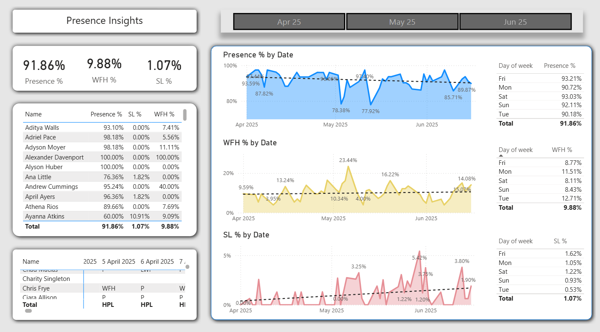
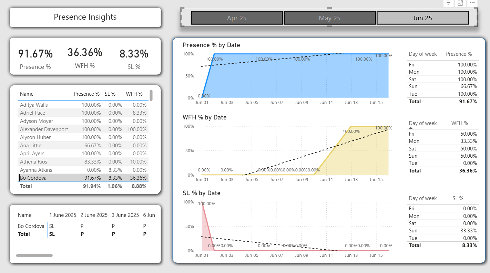
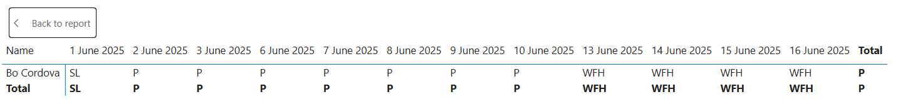
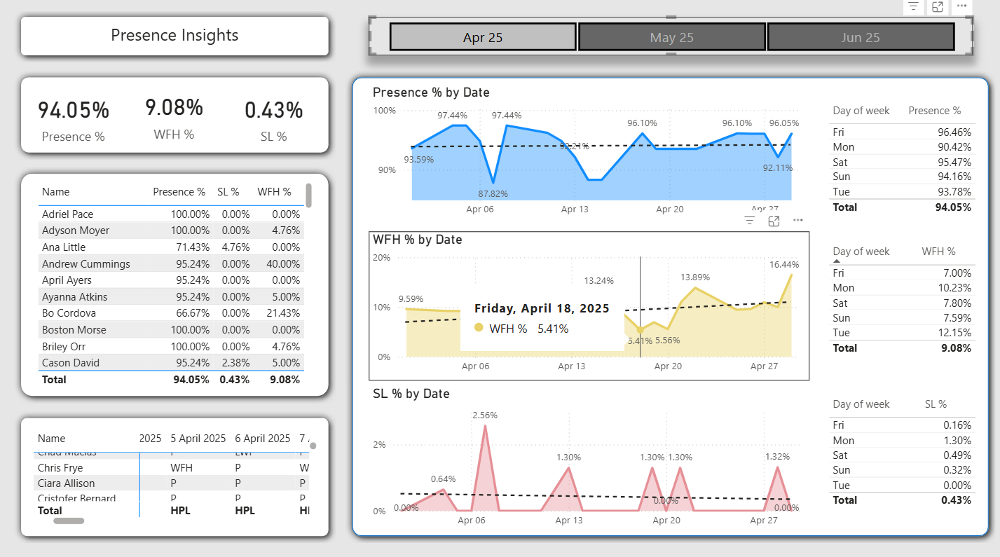

# Employee Attendance Analysis to Identify Productivity Loss Patterns

## Overview
This project analyzes employee attendance data to detect patterns in remote work, sick leave, and overall presence.  
The goal is to identify factors that may impact productivity and workforce efficiency — and provide actionable insights for better workforce planning.

---

## Problem
Companies often lack visibility into:
- Absenteeism trends and their root causes
- Sick leave patterns that may indicate burnout
- Work-from-home distribution across teams

This leads to reduced productivity, poor resource allocation, and missed opportunities for intervention.

---

## Data
- Employee attendance records (April–June 2025)
- Work-from-home vs. office presence per employee
- Sick leave data over time
- Day-of-week breakdowns

---

## Dashboard Overview

### 📊 Main Dashboard — Full 3-Month View (Apr–Jun 2025)

Overall presence across the team sits at **91.86%**, with WFH at **9.88%** and sick leave at **1.07%**. The chart reveals noticeable dips in attendance during specific weeks in May, which may correlate with increased workload or scheduling inefficiencies. Sick leave peaks mid-May, suggesting a potential burnout risk that warrants further investigation.

---

### 📅 Monthly Filter — April 2025

Filtering by April shows a strong overall presence of **94.05%**, but a spike in sick leave around April 8 (2.56%) stands out. This isolated peak — occurring just after the week starts — may indicate early-week burnout patterns. WFH usage remains low but starts climbing toward month-end, pointing to a gradual shift in hybrid work behavior.

---

### 👤 Individual Employee View — Filtered by Name

Drilling into a specific employee (Bo Cordova) reveals a presence rate of **91.67%**, with sick leave at **8.33%** and WFH at **36.36%** — significantly higher than the team average. This kind of outlier behavior is worth flagging for HR review, as it may indicate either personal circumstances or inconsistent policy enforcement.

---

### 📆 Detailed Attendance Log — Per Employee Per Day

The detailed daily view shows exact attendance statuses (P = Present, WFH = Work from Home, SL = Sick Leave) for each working day. For Bo Cordova, the transition from sick leave in early June to consistent WFH in the second half of the month is clearly visible — useful data for pattern detection and HR decision-making.

---

### 📈 Monthly Summary — Filtered by Month

Month-level filtering provides a clean summary of attendance KPIs. The breakdown by day of week reveals that **Tuesdays** consistently show lower presence (90.18%), while **Fridays** and **Saturdays** perform stronger. This day-of-week pattern is actionable — it can guide scheduling, meeting placement, and workload distribution.

---

## Key Insights

- **Sick leave spikes at specific periods**, particularly early in the workweek, potentially indicating burnout or workload imbalance
- **WFH distribution is uneven** across employees — some team members are far above average, suggesting inconsistent hybrid work policies
- **Attendance dips mid-May** across the full team, impacting overall productivity during that period
- **Tuesday presence is lowest** across all months, which may call for policy adjustments or targeted engagement
- **A small number of employees** account for a disproportionate share of absences — identifying them allows for early intervention

---

## Business Value

This analysis helps organizations:
- Identify productivity loss patterns before they escalate
- Detect potential burnout risks by monitoring absence spikes
- Optimize hybrid work policies based on real behavior data
- Improve workforce planning with day-of-week and monthly trend visibility

---

## Tools Used
- Power BI (Dashboard & Visualization)
- DAX (KPI calculations)
- Data Modeling & Filtering
- KPI Tracking (Presence %, WFH %, SL %)

---

## Conclusion

This project demonstrates how raw attendance data can be transformed into actionable workforce insights. Rather than simply tracking who showed up, the dashboard surfaces patterns that directly support HR decision-making — from identifying burnout risk to optimizing hybrid work policies.
